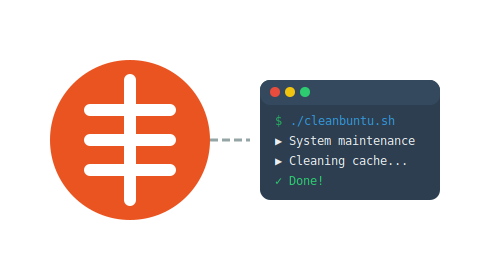

# Cleanbuntu - Desktop Maintenance Toolkit 🧼💻

> أداة صيانة ذكية وتفاعلية تدعم العربية والإنجليزية.



---

## 📌 نظرة عامة

Cleanbuntu هي أداة صيانة شاملة لأنظمة Ubuntu/Linux مكتوبة بالكامل بلغة **Bash**، تقدم تجربة تفاعلية عبر واجهة CLI مصممة باحتراف، وتدعم كلا من اللغة **العربية** و**الإنجليزية**. لمن يبحث عن صيانة آمنة ومرنة لأجهزته.

---

## ✨ المميزات

- ✅ واجهة CLI تفاعلية ثنائية اللغة (عربي / إنجليزي)
- 🔒 نظام قفل ذكي يمنع التشغيل المتزامن
- 🧠 تنظيف النظام من الملفات المؤقتة وذاكرة التخزين
- 💾 نسخ احتياطي واستعادة شاملة لإعدادات النظام والتطبيقات
- 📊 معلومات مفصلة عن النظام (RAM, CPU, GPU, Disk, Battery...)
- ⚙️ تحديث النظام بشكل آمن مع دعم توزيعات متعددة
- 🛠️ أدوات استكشاف الأخطاء وإصلاحها
- 🔧 إعدادات قابلة للتخصيص بالكامل
- 📦 دعم APT / DNF / YUM / Pacman بشكل ذكي

---

## 🚀 التثبيت السريع

```bash
sudo bash install.sh
```

📝 سيقوم المثبّت بـ:

- إنشاء المجلدات الأساسية
- حفظ الإعدادات في `~/.config/cleanbuntu`
- نسخ الملفات التشغيلية
- إعداد الأمر `cleanbuntu` كنقطة دخول CLI

---

## 🧪 الاستخدام

يوفر Cleanbuntu أوامر سريعة مرنة تتيح تنفيذ المهام مباشرة من الطرفية، دون الحاجة للدخول إلى الواجهة التفاعلية. هذه الأوامر مثالية للمستخدمين المتقدمين أو للدمج مع مهام مجدولة (cron jobs) أو سكربتات خارجية.

بعد التثبيت:

```bash
sudo cleanbuntu
```

أو عبر الأوامر السريعة:

```bash
cleanbuntu --clean       # تنظيف النظام
cleanbuntu --update      # تحديث الحزم
cleanbuntu --backup      # إنشاء نسخة احتياطية
cleanbuntu --restore     # استعادة من نسخة
cleanbuntu --config      # تعديل الإعدادات
cleanbuntu --health      # فحص الحالة العامة
```

---

## 🗂️ هيكل الملفات

يُفضل الحفاظ على هذا الترتيب للملفات ضمن بنية المشروع لضمان عمل الأداة بشكل صحيح، حيث أن كل ملف يؤدي دورًا محددًا في تسلسل التنفيذ والوظائف.

```
.
├── main.sh               # نقطة البداية الرئيسية
├── install.sh            # المثبّت الذكي
├── unstall.sh            # أداة إزالة نظيفة
├── config.sh             # إدارة الإعدادات والتحميل
├── utils.sh              # الدوال العامة والألوان والتسجيل
├── ui.sh                 # واجهة المستخدم والقوائم
├── system.sh             # عرض معلومات النظام
├── maintenance.sh        # عمليات التنظيف الذكية
├── backup.sh             # النسخ الاحتياطي والاستعادة
```

---

## 🧠 متطلبات التشغيل

- نظام Ubuntu أو مشتقاته (يدعم أيضًا توزيعات أخرى بشكل جزئي)
- Bash 4+
- أوامر أساسية: `tar`, `rsync`, `du`, `pv`, `lspci`, `sensors`
- صلاحيات `sudo`

---

## 🪪 الترخيص

تم إصدار Cleanbuntu تحت رخصة [MIT License](LICENSE) – حر للاستخدام، التعديل، والنشر مع الحفاظ على حقوق المؤلف.

---

## 👨‍💻 المطور

**Fahad Alsharari**  
💼 https://FahadAlsharari.sa  
📬 admin@FahadAlsharari.sa

تابعني على GitHub: [github.com/FahadSalehAlsharari](https://github.com/FahadSalehAlsharari)

---

## 🌟 هل أعجبتك الأداة؟

ادعمني بنجمة ⭐ على GitHub، وساهم بتطويرها، أو شاركها مع من يهتم بأدوات الصيانة الاحترافية على لينكس.

---

> "أداة صُممت بلغة عربية، برؤية احترافية، للمحترفين الذين يقدّرون البساطة والأناقة."

---

# Cleanbuntu - Desktop Maintenance Toolkit 🧼💻

> A smart and interactive maintenance tool with Arabic and English support.


---

## 📌 Overview

Cleanbuntu is a comprehensive maintenance tool for Ubuntu/Linux systems written entirely in **Bash**, offering an interactive experience through a professionally designed CLI interface, supporting both **Arabic** and **English**. For those seeking safe and flexible maintenance for their devices.

---

## ✨ Features

- ✅ Bilingual interactive CLI interface (Arabic / English)
- 🔒 Smart locking system to prevent concurrent execution
- 🧠 System cleanup from temporary files and cache
- 💾 Comprehensive backup and restore of system settings and applications
- 📊 Detailed system information (RAM, CPU, GPU, Disk, Battery...)
- ⚙️ Safe system updates with multi-distribution support
- 🛠️ Troubleshooting tools
- 🔧 Fully customizable settings
- 📦 Smart APT / DNF / YUM / Pacman support

---

## 🚀 Quick Installation

```bash
sudo bash install.sh
```

📝 The installer will:

- Create essential directories
- Save settings in `~/.config/cleanbuntu`
- Copy operational files
- Set up `cleanbuntu` as CLI entry point

---

## 🧪 Usage

Cleanbuntu provides flexible quick commands that allow tasks to be executed directly from the terminal, without needing to enter the interactive interface. These commands are ideal for advanced users or for integration with cron jobs or external scripts.

After installation:

```bash
sudo cleanbuntu
```

Or via quick commands:

```bash
cleanbuntu --clean       # System cleanup
cleanbuntu --update      # Package update
cleanbuntu --backup      # Create backup
cleanbuntu --restore     # Restore from backup
cleanbuntu --config      # Edit settings
cleanbuntu --health     # Check general status
```

## 👨‍💻 Developer

**Fahad Alsharari**  
💼 https://FahadAlsharari.sa  
📬 admin@FahadAlsharari.sa

Follow me on GitHub: [github.com/FahadSalehAlsharari](https://github.com/FahadSalehAlsharari)

---

## 🪪 License

Released under [MIT License](LICENSE) – free to use, modify, and distribute while maintaining copyright.

---

## 🌟 Like the Tool?

Support with a ⭐ on GitHub, contribute to its development, or share it with those interested in professional Linux maintenance tools.